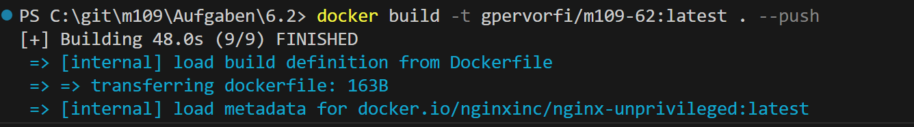
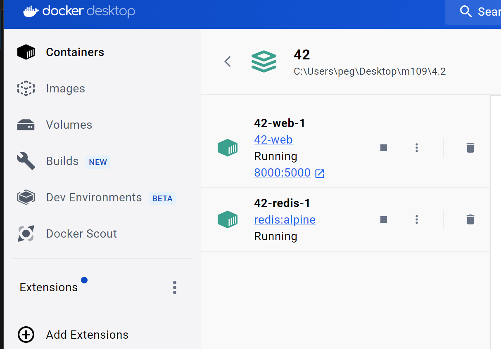
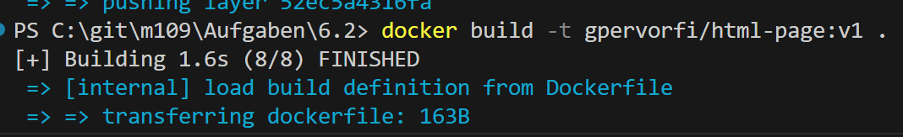
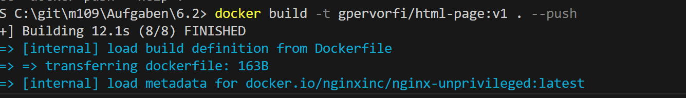

## Auftrag 6.2: HTML-Seite auf OpenShift deployen

Erstellen Sie einen neuen Ordner und kopieren Sie die HTML Seite aus Auftrag 1.1 und das Dockerfile aus Auftrag 3.2.
Ersetzen Sie das Baseimage "nginx" mit "nginxinc/nginx-unprivileged".
Builden und testen Sie den Container, sodass dieser die Webseite auf Port 8080 publiziert.
Pushen Sie den Container in die Github Container Registry:

    docker build -t ghcr.io/<Github Username>/html-page:v1 .
    docker push ghcr.io/<Github Username>/html-page:v1

Erstellen Sie ein Deployment für den Container, wie Sie es in Auftrag 4.2 gelernt haben. Und applizieren Sie dieses:

    oc apply -f deployment.yaml

Fügen Sie dem Deployment folgenden Service und Route hinzu und applizieren Sie das File erneut:

---
apiVersion: v1
kind: Service
metadata:
  labels:
    app: m210-page
  name: m210-page
spec:
  ports:
  - name: 8080-tcp
    port: 8080
    protocol: TCP
    targetPort: 8080
  selector:
    app: m210-page
  sessionAffinity: None
  type: ClusterIP
---
apiVersion: route.openshift.io/v1
kind: Route
metadata:
  labels:
    app: m210-page
  name: m210-page
spec:
  port:
    targetPort: 8080-tcp
  to:
    kind: Service
    name: m210-page
  tls:
    termination: edge   
    insecureEdgeTerminationPolicy: Redirect

    Rufen Sie die erstellte Route ab und testen Sie die Webseite:

    oc get routes

### Vorgehen

Als erstes müssen die Docker gestartet werden. 

sobald das Dockerfile angepasst wurde und die index.html datei in den neuen Ordner kopiert wurde, kann mit diesem Befehl der Docker gebildet werden.

Sobald der docker gestartet ist, kann mann mit dem befehl wie in dem schritt 4. beschrieben, den neuen docker erstellen und pushen. Dafür muss der username verwendet werden, denn man für Github oder docker desktop benutzt, je nach dem mit was man den docker gestartet hat.

    docker build -t gpervorfi/html-page:v1 .

    docker build -t gpervorfi/html-page:v1 . --push

jdj